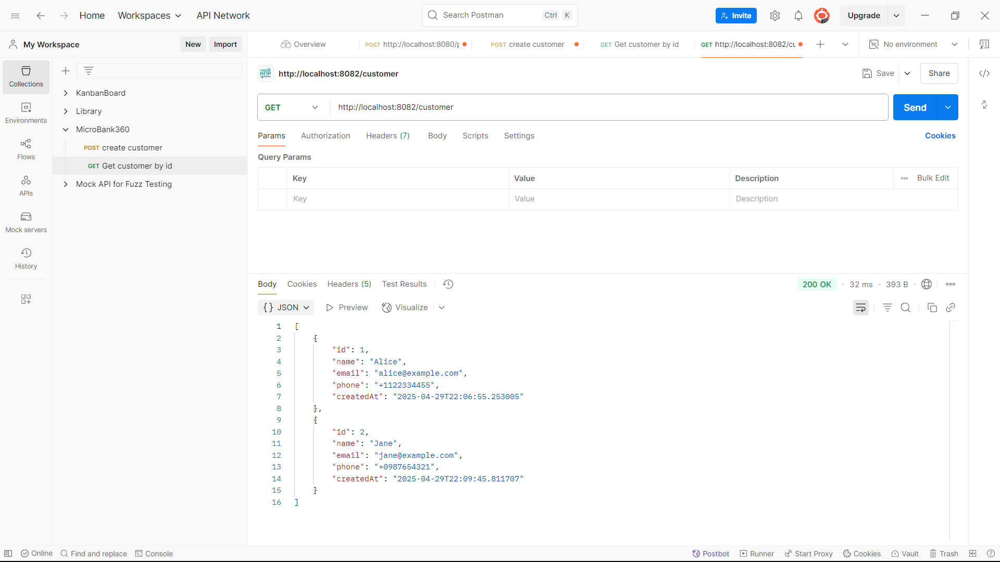
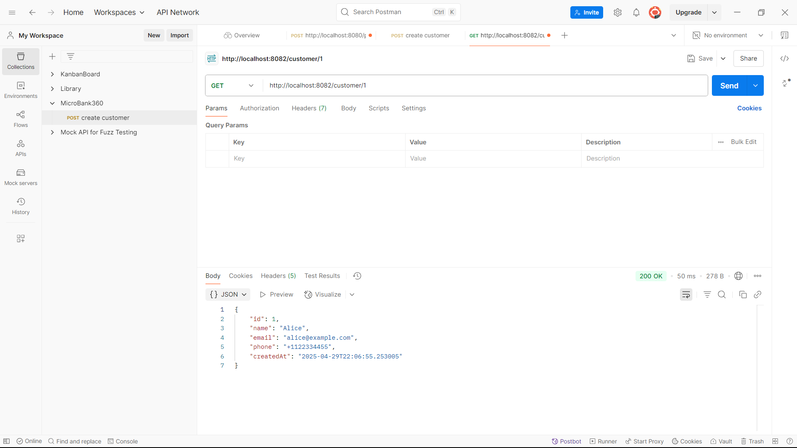

# MicroBank360 - A Scalable Microservices-Based Banking Platform

**MicroBank360** is a modular, scalable banking platform built using the **Microservice Architecture** with **Java Spring Boot**. It simulates core banking functionalities such as customer and account management and is designed to grow with additional services like transactions, notifications, and authentication.

---
---
## Overview

### Key Features

- **Customer Service & Account Service** – Independent microservices with full CRUD operations.
- **Spring Data JPA** – Simplified database interaction via repositories.
- **RESTful APIs** – Structured and consistent API endpoints.
- **OpenFeign** – Declarative REST client for seamless inter-service communication.
- **Eureka (Planned)** – Service discovery and registration for dynamic scaling.
- **Spring Cloud API Gateway (Planned)** – Centralized routing and request handling.
- **Reactive LoadBalancer (Planned)** – Client-side load balancing for resilient service calls.
- **MySQL** – Robust data persistence layer.
- **Postman-Tested** – All endpoints verified through Postman.

### Architecture Vision

The platform is designed for horizontal scalability and easy integration of new services. Planned enhancements include:

- **Eureka Server** for service discovery and dynamic registration.
- **Spring Cloud Gateway** to handle routing, filtering, and authorization.
- **Reactive LoadBalancer** to distribute requests across service instances.
- **Token-based Authentication** for secure access control (future).
- **Centralized Configuration** using Spring Cloud Config (future enhancement).

> MicroBank360 aims to be a production-grade, extensible microservice banking application reflecting real-world enterprise architecture practices.

---
---
## Customer and Account Service - Core Service

This project contains two microservices built using Java, Spring Boot:

1. **Customer Service**: Handles operations related to customer data.
2. **Account Service**: Manages account data and balance updates.

Both services use Spring Data JPA with MySQL for persistent storage.

## Technologies Used
- Backend: Java, Spring Boot, Spring Data JPA
- Database: MySQL
- Build Tool: Maven
- Dependencies: Spring Web, Spring Data JPA, MySQL Connector, Lombok
- Testing API: Postman
- Version Control: GitHub
- Other Tools: IntelliJ IDEA, MySQL Workbench

---

## Customer Service - API Endpoints

| Method | Endpoint             | Description                       |
|--------|----------------------|-----------------------------------|
| GET    | /customer            | Get all customers                 |
| GET    | /customer/{id}       | Get customer by ID                |
| POST   | /customer            | Create a new customer             |
| PUT    | /customer/{id}       | Update a customer's data by ID    |
| DELETE | /customer/{id}       | Delete a customer by ID           |

---

## Account Service - API Endpoints

| Method | Endpoint             | Description                           |
|--------|----------------------|---------------------------------------|
| GET    | /account             | Get all accounts                      |
| GET    | /account/{id}        | Get account by ID                     |
| POST   | /account             | Create a new account                  |
| PUT    | /account/{id}/{balance} | Update account balance by ID         |
| DELETE | /account/{id}        | Delete account by ID                  |

---

## How to Set Up the Project

### 1. Clone the Repositories

Clone both services from GitHub:

```bash
git clone https://github.com/your-username/customer-service.git
git clone https://github.com/your-username/account-service.git
```

### 2. Configure application.properties

Update the following in both services:

```properties
spring.datasource.url=jdbc:mysql://localhost:3306/{your_db_name}
spring.datasource.username=root
spring.datasource.password=your_password
```

### 3. Build & Run the Applications

Open both projects in IntelliJ IDEA:

- Ensure JDK 17 or above is selected.
- Run the main classes:
  - `CustomerServiceApplication.java`
  - `AccountServiceApplication.java`

### 4. Test the Endpoints

- Use **Postman** for making requests to the API.
- Use **MySQL Workbench** to validate data persistence.

### Notes

- Ensure MySQL Server is running and the database exists.
- Update port configurations if needed to avoid conflicts.
- Add screenshots and usage examples to enhance the documentation if necessary.

---

## Usage Examples

### 1. Get all customers
**Request:**

```http
GET /customer
```

**Response:**
```json
[
  {
    "id": 1,
    "name": "John",
    "email": "john@example.com",
    "phone": "+1234567890",
    "createdAt": "2025-04-29T10:00:00"
  },
  {
    "id": 2,
    "name": "Jane",
    "email": "jane@example.com",
    "phone": "+0987654321",
    "createdAt": "2025-04-28T15:30:00"
  }
]
```


---

### 2. Get Customer by ID
**Request:**

```http
GET /customer/1
```

**Response:**
```json
{
  "id": 1,
  "name": "John",
  "email": "john@example.com",
  "phone": "+1234567890",
  "createdAt": "2025-04-29T10:00:00"
}
```


---

### 3. Create a new customer
**Request:**

```http
POST /customer
```

**Request Body:**
```json
{
  "name": "Alice",
  "email": "alice@example.com",
  "phone": "+1122334455"
}
```

**Response:**
```json
{
  "id": 3,
  "name": "Alice",
  "email": "alice@example.com",
  "phone": "+1122334455",
  "createdAt": "2025-04-29T12:00:00"
}
```


---

### 4. Update customer data
**Request:**

```http
PUT /customer/1
```

**Request Body:**
```json
{
  "name": "John Updated",
  "email": "johnupdated@example.com",
  "phone": "+1234567899"
}
```

**Response:**
```json
{
  "id": 1,
  "name": "John Updated",
  "email": "johnupdated@example.com",
  "phone": "+1234567899",
  "createdAt": "2025-04-29T10:00:00"
}
```


---

### 5. Delete a customer
**Request:**

```http
DELETE /customer/1
```

**Response:**
```
Customer 1 gets Deleted from Database.
```


---

### 6. Get all accounts
**Request:**

```http
GET /account
```

**Response:**
```json
[
  {
    "id": 1,
    "accountNumber": "ACC1001",
    "accountType": "SAVINGS",
    "balance": 1500.00,
    "customerId": 1,
    "createdAt": "2025-04-29T10:30:00"
  },
  {
    "id": 2,
    "accountNumber": "ACC1002",
    "accountType": "CURRENT",
    "balance": 2500.00,
    "customerId": 2,
    "createdAt": "2025-04-28T16:00:00"
  }
]
```


---

### 7. Get account by ID
**Request:**

```http
GET /account/1
```

**Response:**
```json
  {
    "id": 1,
    "accountNumber": "ACC1001",
    "accountType": "SAVINGS",
    "balance": 1500.00,
    "customerId": 1,
    "createdAt": "2025-04-29T10:30:00"
  }
```


---

### 8. Create a new account
**Request:**

```http
POST /account
```

**Request Body:**
```json
{
  "accountNumber": "ACC1003",
  "accountType": "SAVINGS",
  "balance": 3000.00,
  "customerId": 1
}
```

**Response:**
```json
{
  "id": 3,
  "accountNumber": "ACC1003",
  "accountType": "SAVINGS",
  "balance": 3000.00,
  "customerId": 1,
  "createdAt": "2025-04-29T12:30:00"
}
```


---

### 9. Update account balance
**Request:**

```http
PUT /account/1/15000
```

**Response:**
```json
{
  "id": 1,
  "accountNumber": "ACC1001",
  "accountType": "SAVINGS",
  "balance": 15000.00,
  "customerId": 1,
  "createdAt": "2025-04-29T10:30:00"
}
```


---

### 10. Delete an account
**Request:**

```http
DELETE /account/1
```

**Response:**
```
Account 1 gets Deleted from Database.
```


---

### 11. Get all accounts by CUSTOMER ID using AccountService
**Request:**

```http
GET /account/customer/1
```

**Response:**
```json
[
  {
    "id": 1,
    "accountNumber": "ACC1001",
    "accountType": "SAVINGS",
    "balance": 15000.00,
    "customerId": 1,
    "createdAt": "2025-04-29T10:30:00"
  },
  {
    "id": 3,
    "accountNumber": "ACC1003",
    "accountType": "SAVINGS",
    "balance": 3000.00,
    "customerId": 1,
    "createdAt": "2025-04-29T12:30:00"
  }
]
```


---

### 12. Get all user info along with their account info using Openfeign for inter service communication

**Request:**

```http
GET /customer/
```

**Response:**
```json
[
    {
        "id": 2,
        "name": "Jane",
        "email": "jane@example.com",
        "phone": "+0987654321",
        "createdAt": "2025-04-29T22:09:45.811707",
        "accounts": []
    },
    {
        "id": 3,
        "name": "Alice",
        "email": "alice@example.com",
        "phone": "+1122334455",
        "createdAt": "2025-04-29T22:30:50.51107",
        "accounts": [
            {
                "id": 2,
                "accountNumber": "ACC1002",
                "accountType": "CURRENT",
                "balance": 2500.00,
                "customerId": 3,
                "createdAt": "2025-04-29T22:32:40.04309"
            },
            {
                "id": 3,
                "accountNumber": "ACC1001",
                "accountType": "SAVINGS",
                "balance": 15000.00,
                "customerId": 3,
                "createdAt": "2025-04-29T23:17:04.860544"
            }
        ]
    }
]
```


---
### 13. Get one user info along with account info using Openfeign for inter service communication
**Request:**

```http
GET /customer/3
```

**Response:**
```json
{
    "id": 3,
    "name": "Alice",
    "email": "alice@example.com",
    "phone": "+1122334455",
    "createdAt": "2025-04-29T22:30:50.51107",
    "accounts": [
        {
            "id": 2,
            "accountNumber": "ACC1002",
            "accountType": "CURRENT",
            "balance": 2500.00,
            "customerId": 3,
            "createdAt": "2025-04-29T22:32:40.04309"
        },
        {
            "id": 3,
            "accountNumber": "ACC1001",
            "accountType": "SAVINGS",
            "balance": 15000.00,
            "customerId": 3,
            "createdAt": "2025-04-29T23:17:04.860544"
        }
    ]
}
```


---


