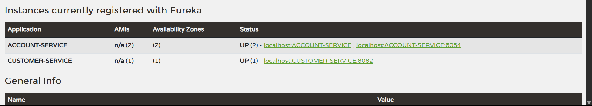

# MicroBank360 - A Scalable Microservices-Based Banking Platform

**MicroBank360** is a modular, scalable banking platform built using the **Microservice Architecture** with **Java Spring Boot**. It simulates core banking functionalities such as customer and account management and is designed to grow with additional services like transactions, notifications, and authentication.

---

---

## I. Project Overview

### Key Features

- **Customer Service & Account Service** – Independent microservices with full CRUD operations.
- **Spring Data JPA** – Simplified database interaction via repositories.
- **RESTful APIs** – Structured and consistent API endpoints.
- **OpenFeign** – Declarative REST client for seamless inter-service communication.
- **Eureka** – Service discovery and registration for dynamic scaling.
- **Spring Cloud API Gateway** – Centralized routing and request handling.
- **Reactive LoadBalancer** – Client-side load balancing for resilient service calls.
- **MySQL** – Robust data persistence layer.
- **Postman-Tested** – All endpoints verified through Postman.

### Architecture Vision

The platform is designed for horizontal scalability and easy integration of new services. Planned enhancements include:

- **Eureka Server** for service discovery and dynamic registration.
- **Spring Cloud Gateway** to handle routing, filtering, and authorization.
- **Reactive LoadBalancer** to distribute requests across service instances.
- **Token-based Authentication** for secure access control (future).
- **Centralized Configuration** using Spring Cloud Config (future enhancement).

> MicroBank360 aims to be a production-grade, extensible microservice banking application reflecting real-world enterprise architecture practices.

---

---

## II. Customer and Account Service - Core Service

This project contains two microservices built using Java, Spring Boot:

1. **Customer Service**: Handles operations related to customer data.
2. **Account Service**: Manages account data and balance updates.

Both services use Spring Data JPA with MySQL for persistent storage.

## Technologies Used
- Backend: Java, Spring Boot, Spring Data JPA
- Database: MySQL
- Build Tool: Maven
- Dependencies: Spring Web, Spring Data JPA, MySQL Connector, Lombok(there are further dependencies that i will update below)
- Testing API: Postman
- Version Control: GitHub
- Other Tools: IntelliJ IDEA, MySQL Workbench

---

## Customer Service - API Endpoints

| Method | Endpoint             | Description                                                |
|--------|----------------------|------------------------------------------------------------|
| GET    | /customer            | Get all customers(Updated: Along with account info)        |
| GET    | /customer/{id}       | Get customer by ID(Updated: Along with their account info) |
| POST   | /customer            | Create a new customer                                      |
| PUT    | /customer/{id}       | Update a customer's data by ID                             |
| DELETE | /customer/{id}       | Delete a customer by ID                                    |


---

## Account Service - API Endpoints

| Method | Endpoint             | Description                           |
|--------|----------------------|---------------------------------------|
| GET    | /account             | Get all accounts                      |
| GET    | /account/{id}        | Get account by ID                     |
| POST   | /account             | Create a new account                  |
| PUT    | /account/{id}/{balance} | Update account balance by ID         |
| DELETE | /account/{id}        | Delete account by ID                  |
| GET    | /account/customer/{customerId} | Get all accounts by customer ID  |

---

## How to Set Up the Project

### 1. Clone the Repositories

Clone all services from GitHub:

```bash
git clone https://github.com/PritiAryal/MicroBank360.git
```

### 2. Configure application.properties

Update the following in both services:

```properties
spring.datasource.url=jdbc:mysql://localhost:3306/{your_db_name}
spring.datasource.username=your_username
spring.datasource.password=your_password
```

### 3. Build & Run the Applications

Open both projects in IntelliJ IDEA:

- Ensure JDK 17 or above is selected.
- Run all the main classes of each services such as(you can also run multiple instances of same service to see how load balancing works):
  - `CustomerServiceApplication.java`
  - `AccountServiceApplication.java`

### 4. Test the Endpoints

- Use **Postman** for making requests to the API.
- Use **MySQL Workbench** to validate data persistence.

### Notes

- Ensure MySQL Server is running and the database exists.
- Update port configurations if needed to avoid conflicts.

---

## Usage Examples

### 1. Get all Customer - along with their account info using Openfeign for inter service communication

**Request:**

```http
GET /customer/
```

**Response:**
```json
[
    {
        "id": 2,
        "name": "Jane",
        "email": "jane@example.com",
        "phone": "+0987654321",
        "createdAt": "2025-04-29T22:09:45.811707",
        "accounts": []
    },
    {
        "id": 3,
        "name": "Alice",
        "email": "alice@example.com",
        "phone": "+1122334455",
        "createdAt": "2025-04-29T22:30:50.51107",
        "accounts": [
            {
                "id": 2,
                "accountNumber": "ACC1002",
                "accountType": "CURRENT",
                "balance": 2500.00,
                "customerId": 3,
                "createdAt": "2025-04-29T22:32:40.04309"
            },
            {
                "id": 3,
                "accountNumber": "ACC1001",
                "accountType": "SAVINGS",
                "balance": 15000.00,
                "customerId": 3,
                "createdAt": "2025-04-29T23:17:04.860544"
            }
        ]
    }
]
```


---
### 2. Get Customer by ID - along with account info using Openfeign for inter service communication
**Request:**

```http
GET /customer/3
```

**Response:**
```json
{
    "id": 3,
    "name": "Alice",
    "email": "alice@example.com",
    "phone": "+1122334455",
    "createdAt": "2025-04-29T22:30:50.51107",
    "accounts": [
        {
            "id": 2,
            "accountNumber": "ACC1002",
            "accountType": "CURRENT",
            "balance": 2500.00,
            "customerId": 3,
            "createdAt": "2025-04-29T22:32:40.04309"
        },
        {
            "id": 3,
            "accountNumber": "ACC1001",
            "accountType": "SAVINGS",
            "balance": 15000.00,
            "customerId": 3,
            "createdAt": "2025-04-29T23:17:04.860544"
        }
    ]
}
```


---

### 3. Create a new customer
**Request:**

```http
POST /customer
```

**Request Body:**
```json
{
  "name": "Alice",
  "email": "alice@example.com",
  "phone": "+1122334455"
}
```

**Response:**
```json
{
  "id": 3,
  "name": "Alice",
  "email": "alice@example.com",
  "phone": "+1122334455",
  "createdAt": "2025-04-29T12:00:00"
}
```


---

### 4. Update customer data
**Request:**

```http
PUT /customer/1
```

**Request Body:**
```json
{
  "name": "John Updated",
  "email": "johnupdated@example.com",
  "phone": "+1234567899"
}
```

**Response:**
```json
{
  "id": 1,
  "name": "John Updated",
  "email": "johnupdated@example.com",
  "phone": "+1234567899",
  "createdAt": "2025-04-29T10:00:00"
}
```


---

### 5. Delete a customer
**Request:**

```http
DELETE /customer/1
```

**Response:**
```
Customer 1 gets Deleted from Database.
```


---

### 6. Get all accounts
**Request:**

```http
GET /account
```

**Response:**
```json
[
  {
    "id": 1,
    "accountNumber": "ACC1001",
    "accountType": "SAVINGS",
    "balance": 1500.00,
    "customerId": 1,
    "createdAt": "2025-04-29T10:30:00"
  },
  {
    "id": 2,
    "accountNumber": "ACC1002",
    "accountType": "CURRENT",
    "balance": 2500.00,
    "customerId": 2,
    "createdAt": "2025-04-28T16:00:00"
  }
]
```


---

### 7. Get account by ID
**Request:**

```http
GET /account/1
```

**Response:**
```json
  {
    "id": 1,
    "accountNumber": "ACC1001",
    "accountType": "SAVINGS",
    "balance": 1500.00,
    "customerId": 1,
    "createdAt": "2025-04-29T10:30:00"
  }
```


---

### 8. Create a new account
**Request:**

```http
POST /account
```

**Request Body:**
```json
{
  "accountNumber": "ACC1003",
  "accountType": "SAVINGS",
  "balance": 3000.00,
  "customerId": 1
}
```

**Response:**
```json
{
  "id": 3,
  "accountNumber": "ACC1003",
  "accountType": "SAVINGS",
  "balance": 3000.00,
  "customerId": 1,
  "createdAt": "2025-04-29T12:30:00"
}
```


---

### 9. Update account balance
**Request:**

```http
PUT /account/1/15000
```

**Response:**
```json
{
  "id": 1,
  "accountNumber": "ACC1001",
  "accountType": "SAVINGS",
  "balance": 15000.00,
  "customerId": 1,
  "createdAt": "2025-04-29T10:30:00"
}
```


---

### 10. Delete an account
**Request:**

```http
DELETE /account/1
```

**Response:**
```
Account 1 gets Deleted from Database.
```


---

### 11. Get all accounts by CUSTOMER ID using AccountService
**Request:**

```http
GET /account/customer/1
```

**Response:**
```json
[
  {
    "id": 1,
    "accountNumber": "ACC1001",
    "accountType": "SAVINGS",
    "balance": 15000.00,
    "customerId": 1,
    "createdAt": "2025-04-29T10:30:00"
  },
  {
    "id": 3,
    "accountNumber": "ACC1003",
    "accountType": "SAVINGS",
    "balance": 3000.00,
    "customerId": 1,
    "createdAt": "2025-04-29T12:30:00"
  }
]
```


---

---

## III. Registry Server - Eureka Server

The **Registry Service** acts as the **service discovery server** for the MicroBank360 platform. Built using **Spring Cloud Netflix Eureka**, it enables all microservices to register themselves at runtime and discover each other without hard-coded hostnames or ports.

### Key Features

- Centralized **Service Discovery**
- Dynamic registration and de-registration of microservices
- Enables **client-side load balancing** (via OpenFeign and Spring Cloud LoadBalancer)
- Simplifies inter-service communication

### How It Works

1. When microservices (like Customer Service or Account Service) start, they **register themselves** to the Eureka server.
2. Other services can then **discover these instances dynamically** using their service name.
3. Eureka keeps a **heartbeat** to remove inactive services.

### Dependencies Used

#### Registry Service (Eureka Server)
- **Spring Web**
- **Spring Cloud Discovery - Eureka Server**

#### Added more dependencies to Client Services (Customer Service, Account Service)
- **Spring Cloud OpenFeign**
- **Spring Cloud LoadBalancer**
- **Eureka Discovery Client - Spring Cloud Discovery**



---

---

## IV. API Gateway 

The API Gateway serves as the single entry point for all client requests. It routes requests to the appropriate microservice (e.g., Account Service, Customer Service) and handles concerns like routing, load balancing, and service discovery.

### Dependencies Used
- **Reactive Gateway - Spring Cloud Routing**
- **Eureka Discovery Client - Spring Cloud Discovery**
- **Spring Boot Actuator - OPS**

### Responsibilities
- Route incoming requests to corresponding microservices based on configured paths
- Enable client-side load balancing using Spring Cloud LoadBalancer
- Discover services dynamically via Eureka Server
- Centralize cross-cutting concerns (e.g., logging, authentication, rate limiting – to be added as needed)

### Sample Routes
- `/customer/**` → routed to Customer Service
- `/account/**` → routed to Account Service


