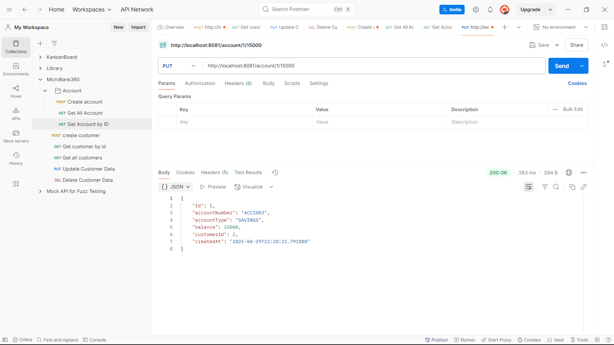

# MicroBank360 - A Scalable Microservices-Based Banking Platform

**MicroBank360** is a modular, scalable banking platform built using the **Microservice Architecture** with **Java Spring Boot**. It simulates core banking functionalities such as customer and account management and is designed to grow with additional services like transactions, notifications, and authentication.

---

---

## I. Project Overview

### Architecture: [View Architecture Design](https://pritiaryal.github.io/MicroBank360ArchitectureDesign/)

### Key Features

- **Customer Service & Account Service** – Independent microservices with full CRUD operations.
- **Spring Data JPA** – Simplified database interaction via repositories.
- **RESTful APIs** – Structured and consistent API endpoints.
- **OpenFeign** – Declarative REST client for seamless inter-service communication.
- **Eureka** – Service discovery and registration for dynamic scaling.
- **Spring Cloud API Gateway** – Centralized routing and request handling.
- **Reactive LoadBalancer** – Client-side load balancing for resilient service calls.
- **MySQL** – Robust data persistence layer.
- **Postman-Tested** – All endpoints verified through Postman.
- **Data Seeder Microservice** – Automated, realistic test data generation for customers and accounts.
- **DataFaker Library** – Authentic, randomized data for development and testing.
- **Batch Processing** – Bulk creation with configurable batch sizes.
- **CSV Export** – Generates customer, account, and JMeter-ready datasets. 
- **Circuit Breaker (Resilience4j)** – Fault tolerance for robust operations. 
- **WebFlux** – Non-blocking, reactive endpoints for high performance. 
- **API Request Collections** – Ready-to-use HTTP and REST files for IntelliJ, VS Code, and Postman. 
- **JMeter Performance and load Test** – Automated performance and load testing with multiple scenarios and reporting. 
- **Shell Scripts** – One-command execution for test automation and reporting.

### Architecture Vision

The platform is designed for horizontal scalability and easy integration of new services. Planned enhancements include:

- **Eureka Server** for service discovery and dynamic registration.
- **Spring Cloud Gateway** to handle routing, filtering, and authorization.
- **Reactive LoadBalancer** to distribute requests across service instances.
- **Data Seeder Service** for realistic test data generation and export.
- **Performance and load Testing** with JMeter automation.
- **Token-based Authentication** for secure access control (future).
- **Centralized Configuration** using Spring Cloud Config (future enhancement).

> MicroBank360 aims to be a production-grade, extensible microservice banking application reflecting real-world enterprise architecture practices.

---

---

## II. Customer and Account Service - Core Service

This project contains two microservices built using Java, Spring Boot:

1. **Customer Service**: Handles operations related to customer data.
2. **Account Service**: Manages account data and balance updates.

Both services use Spring Data JPA with MySQL for persistent storage.

## Technologies Used
- Backend: Java, Spring Boot, Spring Data JPA
- Database: MySQL
- Build Tool: Maven
- Dependencies: Spring Web, Spring Data JPA, MySQL Connector, Lombok(there are further dependencies that i will update below)
- Testing API: Postman
- Version Control: GitHub
- Other Tools: IntelliJ IDEA, MySQL Workbench

---

## Customer Service - API Endpoints

| Method | Endpoint             | Description                                                |
|--------|----------------------|------------------------------------------------------------|
| GET    | /customer            | Get all customers(Updated: Along with account info)        |
| GET    | /customer/{id}       | Get customer by ID(Updated: Along with their account info) |
| POST   | /customer            | Create a new customer                                      |
| PUT    | /customer/{id}       | Update a customer's data by ID                             |
| DELETE | /customer/{id}       | Delete a customer by ID                                    |


---

## Account Service - API Endpoints

| Method | Endpoint             | Description                           |
|--------|----------------------|---------------------------------------|
| GET    | /account             | Get all accounts                      |
| GET    | /account/{id}        | Get account by ID                     |
| POST   | /account             | Create a new account                  |
| PUT    | /account/{id}/{balance} | Update account balance by ID         |
| DELETE | /account/{id}        | Delete account by ID                  |
| GET    | /account/customer/{customerId} | Get all accounts by customer ID  |

---

## How to Set Up the Project

### 1. Clone the Repositories

Clone all services from GitHub:

```bash
git clone https://github.com/PritiAryal/MicroBank360.git
```

### 2. Configure application.properties

Update the following in both services:

```properties
spring.datasource.url=jdbc:mysql://localhost:3306/{your_db_name}
spring.datasource.username=your_username
spring.datasource.password=your_password
```

### 3. Build & Run the Applications

Open both projects in IntelliJ IDEA:

- Ensure JDK 17 or above is selected.
- Run all the main classes of each services such as(you can also run multiple instances of same service to see how load balancing works):
  - `CustomerServiceApplication.java`
  - `AccountServiceApplication.java`

### 4. Test the Endpoints

- Use **Postman** for making requests to the API.
- Use **MySQL Workbench** to validate data persistence.

### Notes

- Ensure MySQL Server is running and the database exists.
- Update port configurations if needed to avoid conflicts.

---

## Usage Examples

### 1. Get all Customer - along with their account info using Openfeign for inter service communication

**Request:**

```http
GET /customer/
```

**Response:**
```json
[
    {
        "id": 2,
        "name": "Jane",
        "email": "jane@example.com",
        "phone": "+0987654321",
        "createdAt": "2025-04-29T22:09:45.811707",
        "accounts": []
    },
    {
        "id": 3,
        "name": "Alice",
        "email": "alice@example.com",
        "phone": "+1122334455",
        "createdAt": "2025-04-29T22:30:50.51107",
        "accounts": [
            {
                "id": 2,
                "accountNumber": "ACC1002",
                "accountType": "CURRENT",
                "balance": 2500.00,
                "customerId": 3,
                "createdAt": "2025-04-29T22:32:40.04309"
            },
            {
                "id": 3,
                "accountNumber": "ACC1001",
                "accountType": "SAVINGS",
                "balance": 15000.00,
                "customerId": 3,
                "createdAt": "2025-04-29T23:17:04.860544"
            }
        ]
    }
]
```


---
### 2. Get Customer by ID - along with account info using Openfeign for inter service communication
**Request:**

```http
GET /customer/3
```

**Response:**
```json
{
    "id": 3,
    "name": "Alice",
    "email": "alice@example.com",
    "phone": "+1122334455",
    "createdAt": "2025-04-29T22:30:50.51107",
    "accounts": [
        {
            "id": 2,
            "accountNumber": "ACC1002",
            "accountType": "CURRENT",
            "balance": 2500.00,
            "customerId": 3,
            "createdAt": "2025-04-29T22:32:40.04309"
        },
        {
            "id": 3,
            "accountNumber": "ACC1001",
            "accountType": "SAVINGS",
            "balance": 15000.00,
            "customerId": 3,
            "createdAt": "2025-04-29T23:17:04.860544"
        }
    ]
}
```


---

### 3. Create a new customer
**Request:**

```http
POST /customer
```

**Request Body:**
```json
{
  "name": "Alice",
  "email": "alice@example.com",
  "phone": "+1122334455"
}
```

**Response:**
```json
{
  "id": 3,
  "name": "Alice",
  "email": "alice@example.com",
  "phone": "+1122334455",
  "createdAt": "2025-04-29T12:00:00"
}
```


---

### 4. Update customer data
**Request:**

```http
PUT /customer/1
```

**Request Body:**
```json
{
  "name": "John Updated",
  "email": "johnupdated@example.com",
  "phone": "+1234567899"
}
```

**Response:**
```json
{
  "id": 1,
  "name": "John Updated",
  "email": "johnupdated@example.com",
  "phone": "+1234567899",
  "createdAt": "2025-04-29T10:00:00"
}
```


---

### 5. Delete a customer
**Request:**

```http
DELETE /customer/1
```

**Response:**
```
Customer 1 gets Deleted from Database.
```


---

### 6. Get all accounts
**Request:**

```http
GET /account
```

**Response:**
```json
[
  {
    "id": 1,
    "accountNumber": "ACC1001",
    "accountType": "SAVINGS",
    "balance": 1500.00,
    "customerId": 1,
    "createdAt": "2025-04-29T10:30:00"
  },
  {
    "id": 2,
    "accountNumber": "ACC1002",
    "accountType": "CURRENT",
    "balance": 2500.00,
    "customerId": 2,
    "createdAt": "2025-04-28T16:00:00"
  }
]
```


---

### 7. Get account by ID
**Request:**

```http
GET /account/1
```

**Response:**
```json
  {
    "id": 1,
    "accountNumber": "ACC1001",
    "accountType": "SAVINGS",
    "balance": 1500.00,
    "customerId": 1,
    "createdAt": "2025-04-29T10:30:00"
  }
```


---

### 8. Create a new account
**Request:**

```http
POST /account
```

**Request Body:**
```json
{
  "accountNumber": "ACC1003",
  "accountType": "SAVINGS",
  "balance": 3000.00,
  "customerId": 1
}
```

**Response:**
```json
{
  "id": 3,
  "accountNumber": "ACC1003",
  "accountType": "SAVINGS",
  "balance": 3000.00,
  "customerId": 1,
  "createdAt": "2025-04-29T12:30:00"
}
```


---

### 9. Update account balance
**Request:**

```http
PUT /account/1/15000
```

**Response:**
```json
{
  "id": 1,
  "accountNumber": "ACC1001",
  "accountType": "SAVINGS",
  "balance": 15000.00,
  "customerId": 1,
  "createdAt": "2025-04-29T10:30:00"
}
```


---

### 10. Delete an account
**Request:**

```http
DELETE /account/1
```

**Response:**
```
Account 1 gets Deleted from Database.
```


---

### 11. Get all accounts by CUSTOMER ID using AccountService
**Request:**

```http
GET /account/customer/1
```

**Response:**
```json
[
  {
    "id": 1,
    "accountNumber": "ACC1001",
    "accountType": "SAVINGS",
    "balance": 15000.00,
    "customerId": 1,
    "createdAt": "2025-04-29T10:30:00"
  },
  {
    "id": 3,
    "accountNumber": "ACC1003",
    "accountType": "SAVINGS",
    "balance": 3000.00,
    "customerId": 1,
    "createdAt": "2025-04-29T12:30:00"
  }
]
```


---

---

## III. Registry Server - Eureka Server

The **Registry Service** acts as the **service discovery server** for the MicroBank360 platform. Built using **Spring Cloud Netflix Eureka**, it enables all microservices to register themselves at runtime and discover each other without hard-coded hostnames or ports.

### Key Features

- Centralized **Service Discovery**
- Dynamic registration and de-registration of microservices
- Enables **client-side load balancing** (via OpenFeign and Spring Cloud LoadBalancer)
- Simplifies inter-service communication

### How It Works

1. When microservices (like Customer Service or Account Service) start, they **register themselves** to the Eureka server.
2. Other services can then **discover these instances dynamically** using their service name.
3. Eureka keeps a **heartbeat** to remove inactive services.

### Dependencies Used

#### Registry Service (Eureka Server)
- **Spring Web**
- **Spring Cloud Discovery - Eureka Server**

#### Added more dependencies to Client Services (Customer Service, Account Service)
- **Spring Cloud OpenFeign**
- **Spring Cloud LoadBalancer**
- **Eureka Discovery Client - Spring Cloud Discovery**


---

---

## IV. API Gateway 

The API Gateway serves as the single entry point for all client requests. It routes requests to the appropriate microservice (e.g., Account Service, Customer Service) and handles concerns like routing, load balancing, and service discovery.

### Dependencies Used
- **Reactive Gateway - Spring Cloud Routing**
- **Eureka Discovery Client - Spring Cloud Discovery**
- **Spring Boot Actuator - OPS**

### Responsibilities
- Route incoming requests to corresponding microservices based on configured paths
- Enable client-side load balancing using Spring Cloud LoadBalancer
- Discover services dynamically via Eureka Server
- Centralize cross-cutting concerns (e.g., logging, authentication, rate limiting – to be added as needed)

### Sample Routes
- `/customer/**` → routed to Customer Service
- `/account/**` → routed to Account Service


---

---

## V. Data Seeder Service

The **Data Seeder Service** is a dedicated microservice designed to generate realistic test data for performance testing and development environments. It provides API-based data generation with export capabilities for JMeter testing.

### Key Features

- **API-Based Data Generation**: RESTful endpoints for creating customers and accounts
- **Realistic Data**: Uses DataFaker library for generating authentic-looking test data
- **Batch Processing**: Supports bulk creation with configurable batch sizes
- **Export Capabilities**: Generates CSV files optimized for JMeter consumption
- **Circuit Breaker**: Resilience4j integration for fault tolerance
- **Service Discovery**: Integrates with Eureka for dynamic service communication
- **Reactive Programming**: Uses WebFlux for non-blocking, asynchronous operations

### Architecture Components


#### Configuration
- **Port**: 8088
- **Service Name**: DATA-SEEDER-SERVICE
- **Database**: Communicates with existing Customer and Account services
- **Circuit Breaker**: Configured with Resilience4j for fault tolerance

#### Key Dependencies
- Spring Boot Web & WebFlux
- Spring Cloud Netflix Eureka Client
- Spring Cloud Circuit Breaker (Resilience4j)
- Spring Cloud LoadBalancer
- DataFaker (for realistic data generation)
- OpenCSV (for CSV export functionality)

### Data Seeder API Endpoints

| Method | Endpoint | Description |
|--------|----------|-------------|
| POST | `/seed/customers/{count}` | Generate specified number of customers |
| POST | `/seed/accounts` | Generate accounts for existing customers |
| POST | `/seed/full-dataset` | Generate complete dataset (customers + accounts) |
| GET | `/seed/export/jmeter-data.csv` | Export JMeter-ready combined data as CSV |
| GET | `/seed/export/customers.csv` | Export all customers as CSV |
| GET | `/seed/export/accounts.csv` | Export all accounts as CSV |
| GET | `/seed/stats` | Get seeding statistics |
| GET | `/seed/health` | Health check endpoint |
| DELETE | `/seed/cleanup` | Clean up all seeded data |


### Benefits
- **Production Safety**: No seeding code in business services
- **Performance Testing Ready**: Optimized for JMeter data consumption
- **Industry Standards**: Follows microservice best practices
- **Separation of Concerns**: Centralized data generation logic
- **Fault Tolerance**: Circuit breaker patterns for resilient operations

---

---

## VI. API Request Collections

The **apiRequests** directory contains organized HTTP request collections for testing all microservices. These collections provide ready-to-use API calls for development and testing.

### Data Seeder Service Requests

The `seed.http` file contains comprehensive API requests for the Data Seeder Service:

#### Sample Requests

**Generate Customers:**
```http
### Seed 500 customers
POST http://localhost:8085/seed/customers/250
Content-Type: application/json
```


**Generate Accounts:**
```http
### Seed accounts for existing customers
POST http://localhost:8085/seed/accounts?minAccountsPerCustomer=1&maxAccountsPerCustomer=2
Content-Type: application/json
```


**Generate Full Dataset:**
```http
### Seed full dataset
POST http://localhost:8085/seed/full-dataset?customerCount=300&minAccountsPerCustomer=1&maxAccountsPerCustomer=2
Content-Type: application/json
```


**Export Data for JMeter:**
```http
### Export combined JMeter-ready test data as CSV
GET http://localhost:8085/seed/export/jmeter-data.csv
Accept: text/csv
```


**Statistics Check:**
```http
### Statistics check
GET http://localhost:8085/seed/stat
Accept: application/json
```


**Cleanup Seeded Data:**
```http
### Cleanup all seeded data
DELETE http://localhost:8085/seed/cleanup
```


### Usage
- Compatible with IntelliJ IDEA HTTP Client
- Compatible with VS Code REST Client extension
- Ready-to-execute requests for rapid development and testing

---

---

## VII. Testing - JMeter Tests

The **jmeter-tests** directory contains a comprehensive performance and load testing suite designed for the MicroBank360 banking platform.

### Key Features

- **Professional Test Scripts**: Industry-standard JMeter test plans
- **Multiple Test Scenarios**: Baseline, Load, Stress, and Spike testing
- **Automated Execution**: Shell scripts for different testing scenarios
- **Realistic Data Sets**: CSV files with banking test data
- **Comprehensive Reporting**: Detailed performance metrics and HTML reports
- **Configurable Parameters**: Flexible test configuration via command-line parameters

### Test Suite Components

#### Test Scripts

1. **microbank360-performance-test.jmx**
  - Main professional performance and load test suite
  - Configurable parameters (threads, duration, ramp-up)
  - Supports multiple test scenarios

2. **foolproof-test.jmx**
  - Simple test for validation
  - Basic health checks and API calls


#### Execution Scripts

1. **run-microbank360-tests.sh**
  - Comprehensive test runner with multiple scenarios
  - Professional reporting and metrics
  - Supports baseline, load, stress, and spike tests

2. **quick-microbank360-test.sh**
  - Quick validation testing
  - Minimal setup for rapid feedback


#### Test Data Files

1. **customers.csv** - Sample customer data with realistic information
2. **accounts.csv** - Account data with various account types and balances
3. **jmeter_testdata.csv** - Combined customer-account data for JMeter consumption

### Test Scenarios

| Scenario | Virtual Users | Duration | Ramp-up | Expected TPS | Description |
|----------|---------------|----------|---------|--------------|-------------|
| Baseline | 10 | 180s | 30s | 5 | Minimal load baseline |
| Load | 25 | 300s | 60s | 15 | Normal production load |
| Stress | 100 | 300s | 90s | 50 | High stress testing |
| Spike | 200 | 120s | 20s | 100 | Traffic spike simulation |

### Test Endpoints Coverage

The performance tests cover critical banking endpoints:

- **Health Checks**: `/seed/health`
- **Customer Operations**: `/customer/{id}`
- **Account Operations**: `/account/{id}`
- **Customer-Account Relations**: Various customer and account combinations

### Reporting Features

- **Real-time Metrics**: Live performance monitoring during test execution
- **CSV Results**: Raw data for detailed analysis
- **Pass/Fail Criteria**: Automated test validation with success thresholds

### Professional Features

- **Progress Tracking**: Real-time test execution progress
- **Error Handling**: Robust error detection and reporting
- **Configurable Thresholds**: Customizable success criteria
- **Batch Processing**: Efficient handling of large test datasets

---

---

## How to Set Up the Complete Project

### 1. Clone the Repository

```bash
git clone https://github.com/PritiAryal/MicroBank360.git
cd MicroBank360
```

### 2. Configure Database Connections

Update the following in all service application.properties files:

```properties
spring.datasource.url=jdbc:mysql://localhost:3306/{your_db_name}
spring.datasource.username=your_username
spring.datasource.password=your_password
```

### 3. Build & Run All Services

Start services in the following order:

1. **Registry Service (Eureka Server)**
   ```bash
   cd registryService
   mvn spring-boot:run
   ```

2. **Customer Service**
   ```bash
   cd customerService
   mvn spring-boot:run
   ```

3. **Account Service**
   ```bash
   cd accountService
   mvn spring-boot:run
   ```

4. **API Gateway**
   ```bash
   cd gatewayService
   mvn spring-boot:run
   ```

5. **Data Seeder Service**
   ```bash
   cd dataSeederService
   mvn spring-boot:run
   ```

### 4. Generate Test Data

Use the Data Seeder Service to populate your database:

```http
POST http://localhost:8088/seed/full-dataset?customerCount=100&minAccountsPerCustomer=1&maxAccountsPerCustomer=3
```

### 5. Run Tests

Make sure Jmeter is installed and Navigate to the jmeter-tests directory and run:

```bash
cd jmeter-tests
./run-microbank360-tests.sh
```

### 6. Test API Endpoints

- Use the HTTP files in **apiRequests** directory with IntelliJ IDEA or VS Code
- Use **Postman** for manual API testing
- Check **Eureka Dashboard** at http://localhost:8761 for service registration

### Service Ports

| Service | Port |
|---------|------|
| Registry Service (Eureka) | 8761 |
| Customer Service | 8082 |
| Account Service | 8080 |
| API Gateway | 8084 |
| Data Seeder Service | 8088 |

### Notes

- Ensure MySQL Server is running and databases exist
- All services will register with Eureka automatically
- API Gateway provides unified access to all services
- Use Data Seeder Service for generating realistic test data
- Performance and load tests require JMeter to be installed or available in the jmeter-tests directory

---


